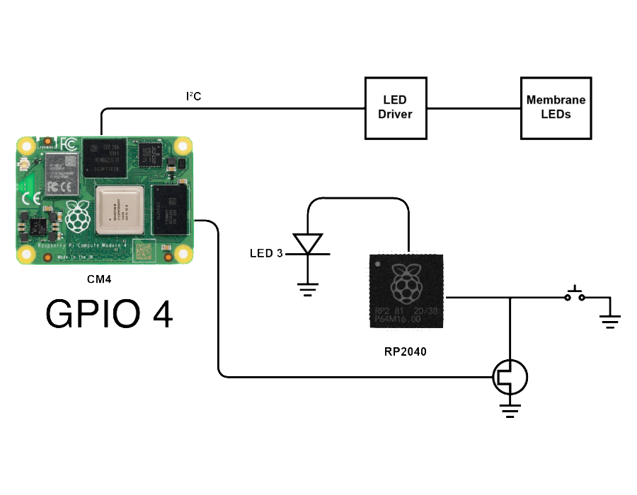

# Control membrane LEDs and Trigger Button

## 7. Control membrane LEDs and Trigger Button

<div class="text--center">

<figure>


<figcaption></figcaption>
</figure>
</div>

:::info[info]

**Note -** (if you have followed the [Software setup](/software-setup) page you can skip this step)

:::

Before you can address the membrane, you will need to activate the `i2c_vc` interface. To do that you need to run the following command:

```bash
echo "dtparam=i2c_vc=on" | sudo tee -a /boot/config.txt
```
After this you need to reboot the pi, `sudo reboot` will do the job.

#### Download the below file to control membrane LEDs and trigger buttons.

import DownloadBox from '@site/src/components/DownloadBox';

<DownloadBox fileName="membrane.py" fileSize="4KB" filePath="/downloads/membrane.py" />